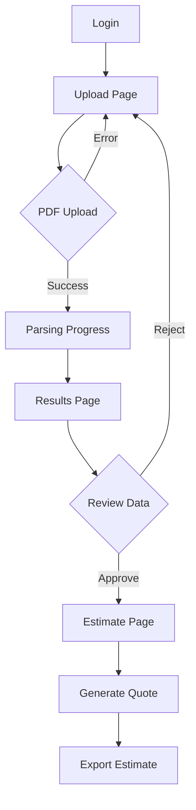

## 1. Product Overview
A web-based estimating software for exterior contractors that automatically parses EagleView PDF reports to extract roof, wall, and opening measurements. The system generates material orders with supplier pricing and calculates labor costs with custom upcharges, streamlining the sales estimation process for field salesmen.

This tool eliminates manual measurement entry, reduces estimation errors, and provides consistent pricing for exterior renovation projects including roofing, siding, and window/door installations.

## 2. Core Features

### 2.1 User Roles
| Role | Registration Method | Core Permissions |
|------|---------------------|------------------|
| Salesman | Admin invitation | Upload EagleView PDFs, view parsed data, generate estimates, manage customer projects |
| Admin | Initial setup | Configure supplier pricing, labor rates, manage users, view all estimates |

### 2.2 Feature Module
The estimating software consists of the following main pages:
1. **Upload Page**: EagleView PDF upload, parsing progress, data validation
2. **Results Page**: Parsed measurements display, material calculation, labor estimation
3. **Estimate Page**: Final quote generation, pricing summary, export options

### 2.3 Page Details
| Page Name | Module Name | Feature description |
|-----------|-------------|---------------------|
| Upload Page | File Upload | Drag-and-drop or browse to select EagleView PDF files up to 50MB |
| Upload Page | Progress Indicator | Show parsing status with percentage completion and current extraction step |
| Upload Page | Validation | Display upload errors, file format validation, parsing success/failure messages |
| Results Page | Roof Measurements | Display total area, pitch breakdown, linear measurements (ridges, hips, valleys, eaves) |
| Results Page | Wall Measurements | Show total wall area, siding area, masonry area by wall facet |
| Results Page | Openings List | List all windows and doors with dimensions, wall direction, and area calculations |
| Results Page | Waste Calculations | Display suggested waste percentage and material quantities in squares |
| Results Page | Material Preview | Calculate preliminary material quantities based on parsed measurements |
| Estimate Page | Supplier Pricing | Apply configured supplier pricing to material quantities |
| Estimate Page | Labor Calculation | Calculate labor costs using predefined rates and complexity factors |
| Estimate Page | Final Quote | Generate comprehensive estimate with materials, labor, and total cost |
| Estimate Page | Export Options | Download estimate as PDF or export data for external systems |

## 3. Core Process
**Salesman Flow:**
1. Salesman logs into the web application from tablet/laptop
2. Navigates to Upload Page and selects EagleView PDF from local storage
3. System processes PDF and displays parsing progress
4. Once complete, salesman reviews parsed measurements on Results Page
5. System automatically calculates material quantities and applies supplier pricing
6. Salesman adds any manual adjustments or additional items
7. System generates final estimate with labor costs
8. Salesman exports estimate for customer presentation

**Admin Flow:**
1. Admin configures supplier pricing tables and labor rates
2. Sets up user accounts for sales team members
3. Reviews and approves estimate templates
4. Monitors system usage and estimate generation statistics

## 4. User Interface Design

### 4.1 Design Style
- **Primary Color**: #2563eb (Professional blue for trust and reliability)
- **Secondary Color**: #64748b (Neutral gray for professional appearance)
- **Accent Color**: #10b981 (Green for success states and positive actions)
- **Button Style**: Rounded corners with subtle shadows, primary actions in blue
- **Font**: Inter font family, 16px base size for readability
- **Layout**: Card-based design with clear visual hierarchy
- **Icons**: Heroicons for consistent, professional iconography

### 4.2 Page Design Overview
| Page Name | Module Name | UI Elements |
|-----------|-------------|-------------|
| Upload Page | File Upload | Large drag-and-drop zone with PDF icon, file browser button, supported formats hint |
| Upload Page | Progress Bar | Animated progress bar with step indicators (Uploading → Parsing → Complete) |
| Results Page | Measurements Cards | Grid layout with measurement cards showing area charts, pitch breakdowns, and linear measurements |
| Results Page | Data Tables | Sortable tables for windows/doors with search and filter capabilities |
| Estimate Page | Pricing Summary | Material cost breakdown table, labor calculation card, total estimate display |
| Estimate Page | Action Buttons | Primary blue "Generate Estimate" button, secondary "Export" options |

### 4.3 Responsiveness
Desktop-first design approach with tablet optimization. Primary use case involves salesmen working from tablets or laptops in field offices, with full functionality maintained across screen sizes. Touch interactions optimized for tablet use with appropriately sized tap targets.

### 4.4 Data Visualization
- Area measurements displayed with proportional visual representations
- Pitch breakdown shown as horizontal bar chart with percentages
- Material quantities presented in clean tabular format with unit conversions
- Cost breakdowns displayed as stacked bar charts for easy comparison