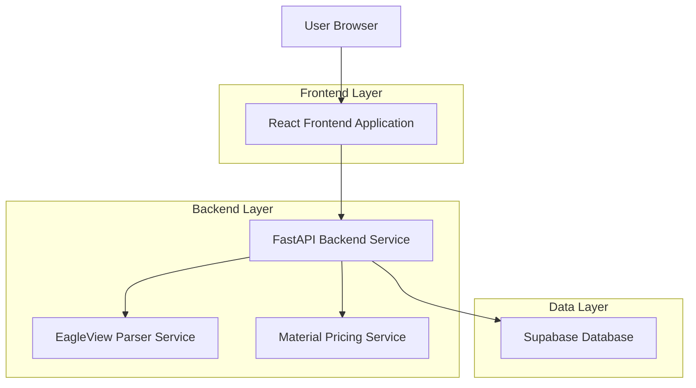
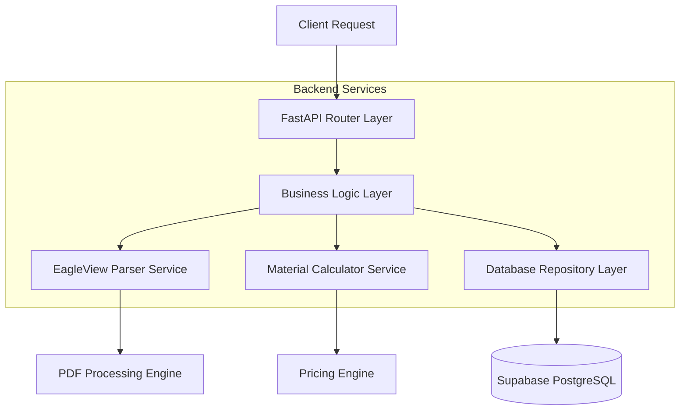
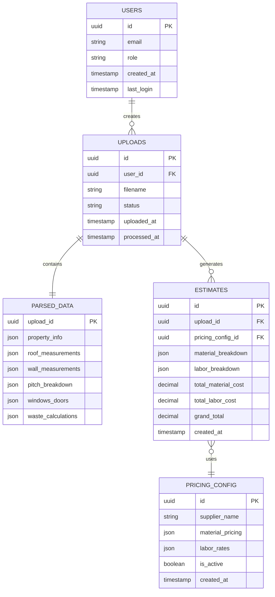

## 1. Architecture design



## 2. Technology Description

* **Frontend**: React\@18 + tailwindcss\@3 + vite

* **Initialization Tool**: vite-init

* **Backend**: FastAPI\@0.104 (Python)

* **Database**: Supabase (PostgreSQL)

* **PDF Processing**: pdfplumber\@0.10

* **File Storage**: Supabase Storage

## 3. Route definitions

| Route          | Purpose                                            |
| -------------- | -------------------------------------------------- |
| /              | Upload page for EagleView PDF files                |
| /results/:id   | Display parsed measurements from uploaded PDF      |
| /estimate/:id  | Generate and display final estimate with pricing   |
| /admin/pricing | Configure supplier pricing and labor rates         |
| /admin/users   | Manage user accounts and permissions               |
| /api/auth/\*   | Authentication endpoints (login, logout, register) |

## 4. API definitions

### 4.1 File Upload API

```
POST /api/upload
```

Request (multipart/form-data):

| Param Name     | Param Type | isRequired | Description                             |
| -------------- | ---------- | ---------- | --------------------------------------- |
| file           | File       | true       | EagleView PDF file (max 50MB)           |
| customer\_name | string     | false      | Optional customer name for the estimate |

Response:

| Param Name | Param Type | Description                                                       |
| ---------- | ---------- | ----------------------------------------------------------------- |
| upload\_id | string     | Unique identifier for the uploaded file                           |
| status     | string     | Processing status: "pending", "processing", "completed", "failed" |
| message    | string     | Status message for user display                                   |

Example Response:

```json
{
  "upload_id": "550e8400-e29b-41d4-a716-446655440000",
  "status": "processing",
  "message": "PDF is being processed..."
}
```

### 4.2 Parse Results API

```
GET /api/parse/:upload_id
```

Response:

| Param Name         | Param Type | Description                    |
| ------------------ | ---------- | ------------------------------ |
| property           | object     | Address and GPS coordinates    |
| report\_info       | object     | EagleView report metadata      |
| roof\_measurements | object     | Complete roof measurement data |
| wall\_measurements | object     | Wall and siding measurements   |
| pitch\_breakdown   | array      | Roof pitch distribution data   |
| suggested\_waste   | object     | Recommended waste calculation  |
| windows\_doors     | array      | All opening measurements       |

### 4.3 Estimate Generation API

```
POST /api/estimate
```

Request:

| Param Name            | Param Type | isRequired | Description                        |
| --------------------- | ---------- | ---------- | ---------------------------------- |
| upload\_id            | string     | true       | Reference to parsed PDF data       |
| material\_pricing\_id | string     | true       | Supplier pricing configuration     |
| labor\_rate\_id       | string     | true       | Labor rate configuration           |
| adjustments           | object     | false      | Manual adjustments to measurements |

Response:

| Param Name            | Param Type | Description                         |
| --------------------- | ---------- | ----------------------------------- |
| estimate\_id          | string     | Unique estimate identifier          |
| total\_material\_cost | number     | Calculated material costs           |
| total\_labor\_cost    | number     | Calculated labor costs              |
| grand\_total          | number     | Final estimate amount               |
| breakdown             | object     | Detailed cost breakdown by category |

## 5. Server architecture diagram



## 6. Data model

### 6.1 Data model definition



### 6.2 Data Definition Language

**Users Table**

```sql
-- create table
CREATE TABLE users (
    id UUID PRIMARY KEY DEFAULT gen_random_uuid(),
    email VARCHAR(255) UNIQUE NOT NULL,
    password_hash VARCHAR(255) NOT NULL,
    name VARCHAR(100) NOT NULL,
    role VARCHAR(20) DEFAULT 'salesman' CHECK (role IN ('salesman', 'admin')),
    created_at TIMESTAMP WITH TIME ZONE DEFAULT NOW(),
    last_login TIMESTAMP WITH TIME ZONE
);

-- create index
CREATE INDEX idx_users_email ON users(email);
CREATE INDEX idx_users_role ON users(role);
```

**Uploads Table**

```sql
-- create table
CREATE TABLE uploads (
    id UUID PRIMARY KEY DEFAULT gen_random_uuid(),
    user_id UUID REFERENCES users(id) ON DELETE CASCADE,
    filename VARCHAR(255) NOT NULL,
    file_path VARCHAR(500) NOT NULL,
    status VARCHAR(20) DEFAULT 'pending' CHECK (status IN ('pending', 'processing', 'completed', 'failed')),
    uploaded_at TIMESTAMP WITH TIME ZONE DEFAULT NOW(),
    processed_at TIMESTAMP WITH TIME ZONE,
    error_message TEXT
);

-- create index
CREATE INDEX idx_uploads_user_id ON uploads(user_id);
CREATE INDEX idx_uploads_status ON uploads(status);
CREATE INDEX idx_uploads_uploaded_at ON uploads(uploaded_at DESC);
```

**Parsed Data Table**

```sql
-- create table
CREATE TABLE parsed_data (
    upload_id UUID PRIMARY KEY REFERENCES uploads(id) ON DELETE CASCADE,
    property_address TEXT,
    property_latitude DECIMAL(10, 8),
    property_longitude DECIMAL(11, 8),
    report_number VARCHAR(50),
    report_date DATE,
    roof_total_area_sqft DECIMAL(10, 2),
    roof_total_facets INTEGER,
    roof_predominant_pitch VARCHAR(10),
    roof_ridges_ft DECIMAL(10, 2),
    roof_hips_ft DECIMAL(10, 2),
    roof_valleys_ft DECIMAL(10, 2),
    roof_rakes_ft DECIMAL(10, 2),
    roof_eaves_ft DECIMAL(10, 2),
    wall_total_area_sqft DECIMAL(10, 2),
    wall_total_facets INTEGER,
    wall_siding_area_sqft DECIMAL(10, 2),
    wall_masonry_area_sqft DECIMAL(10, 2),
    suggested_waste_percent INTEGER,
    suggested_waste_area_sqft DECIMAL(10, 2),
    suggested_waste_squares DECIMAL(10, 2),
    pitch_breakdown JSONB,
    windows_doors JSONB,
    waste_calculations JSONB,
    created_at TIMESTAMP WITH TIME ZONE DEFAULT NOW()
);

-- create index
CREATE INDEX idx_parsed_data_address ON parsed_data(property_address);
```

**Pricing Config Table**

```sql
-- create table
CREATE TABLE pricing_config (
    id UUID PRIMARY KEY DEFAULT gen_random_uuid(),
    supplier_name VARCHAR(100) NOT NULL,
    config_name VARCHAR(100) NOT NULL,
    material_pricing JSONB NOT NULL,
    labor_rates JSONB NOT NULL,
    is_active BOOLEAN DEFAULT true,
    created_by UUID REFERENCES users(id),
    created_at TIMESTAMP WITH TIME ZONE DEFAULT NOW(),
    updated_at TIMESTAMP WITH TIME ZONE DEFAULT NOW()
);

-- create index
CREATE INDEX idx_pricing_config_active ON pricing_config(is_active);
CREATE INDEX idx_pricing_config_supplier ON pricing_config(supplier_name);
```

**Estimates Table**

```sql
-- create table
CREATE TABLE estimates (
    id UUID PRIMARY KEY DEFAULT gen_random_uuid(),
    upload_id UUID REFERENCES uploads(id) ON DELETE CASCADE,
    pricing_config_id UUID REFERENCES pricing_config(id),
    user_id UUID REFERENCES users(id),
    customer_name VARCHAR(200),
    material_breakdown JSONB,
    labor_breakdown JSONB,
    total_material_cost DECIMAL(12, 2),
    total_labor_cost DECIMAL(12, 2),
    grand_total DECIMAL(12, 2),
    status VARCHAR(20) DEFAULT 'draft' CHECK (status IN ('draft', 'sent', 'approved', 'rejected')),
    created_at TIMESTAMP WITH TIME ZONE DEFAULT NOW(),
    sent_at TIMESTAMP WITH TIME ZONE,
    notes TEXT
);

-- create index
CREATE INDEX idx_estimates_upload_id ON estimates(upload_id);
CREATE INDEX idx_estimates_user_id ON estimates(user_id);
CREATE INDEX idx_estimates_status ON estimates(status);
CREATE INDEX idx_estimates_created_at ON estimates(created_at DESC);
```

**Row Level Security Policies**

```sql
-- Grant basic read access to authenticated users
GRANT SELECT ON uploads TO authenticated;
GRANT SELECT ON parsed_data TO authenticated;
GRANT SELECT ON estimates TO authenticated;
GRANT SELECT ON pricing_config TO authenticated;

-- Grant full access to authenticated users for their own data
GRANT ALL PRIVILEGES ON uploads TO authenticated;
GRANT ALL PRIVILEGES ON parsed_data TO authenticated;
GRANT ALL PRIVILEGES ON estimates TO authenticated;

-- Row Level Security
ALTER TABLE uploads ENABLE ROW LEVEL SECURITY;
ALTER TABLE parsed_data ENABLE ROW LEVEL SECURITY;
ALTER TABLE estimates ENABLE ROW LEVEL SECURITY;
ALTER TABLE pricing_config ENABLE ROW LEVEL SECURITY;

-- Users can only see their own uploads
CREATE POLICY "Users can view own uploads" ON uploads
    FOR ALL USING (auth.uid() = user_id);

-- Users can only see their own estimates
CREATE POLICY "Users can view own estimates" ON estimates
    FOR ALL USING (auth.uid() = user_id);

-- Admins can see all pricing configs, users can see active ones
CREATE POLICY "Users can view active pricing" ON pricing_config
    FOR SELECT USING (is_active = true OR EXISTS (
        SELECT 1 FROM users WHERE id = auth.uid() AND role = 'admin'
    ));
```

