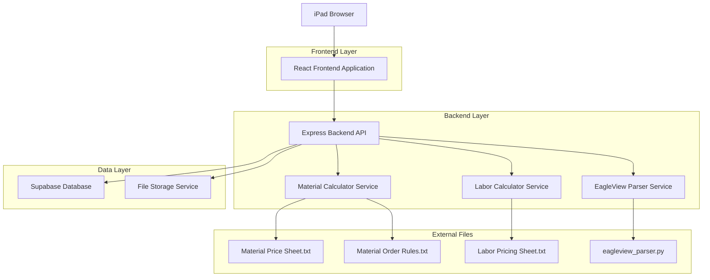
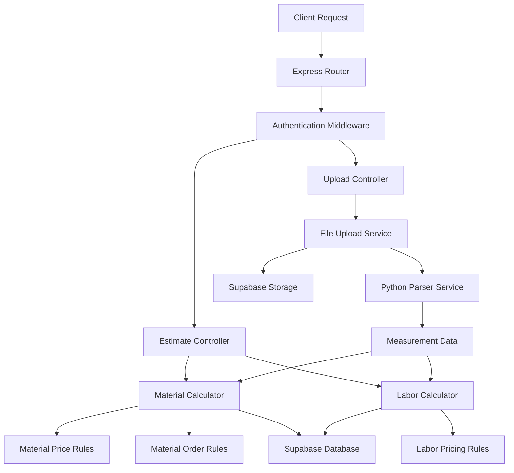
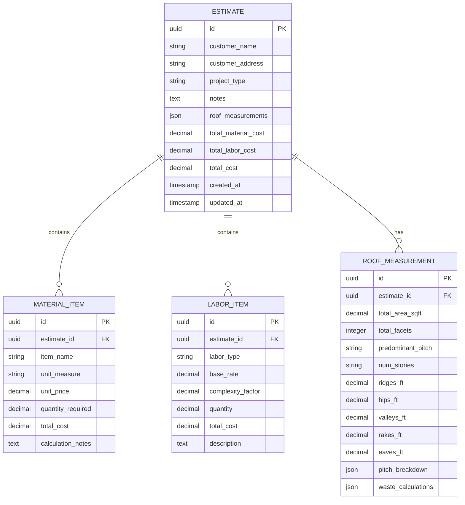

## 1. Architecture Design



## 2. Technology Description

- **Frontend**: React@18 + tailwindcss@3 + vite
- **Initialization Tool**: vite-init
- **Backend**: Express@4 + Node.js
- **Database**: Supabase (PostgreSQL)
- **File Storage**: Supabase Storage
- **PDF Processing**: pdfplumber (via Python subprocess)

## 3. Route Definitions

| Route | Purpose |
|-------|---------|
| / | Upload page - EagleView PDF upload interface |
| /estimate/:id | Estimate page - View calculated costs and breakdowns |
| /history | History page - Browse previous estimates |
| /api/upload | API endpoint - Process uploaded EagleView PDF |
| /api/estimate/:id | API endpoint - Retrieve estimate details |
| /api/estimates | API endpoint - List all estimates with pagination |
| /api/export/:id | API endpoint - Generate PDF quote for download |

## 4. API Definitions

### 4.1 Upload EagleView PDF
```
POST /api/upload
```

Request (multipart/form-data):
| Param Name | Param Type | isRequired | Description |
|------------|-------------|-------------|-------------|
| file | File | true | EagleView PDF file (max 50MB) |
| customer_name | string | true | Customer name for the estimate |
| customer_address | string | true | Property address |
| project_type | string | true | Type of roofing project |
| notes | string | false | Additional project notes |

Response:
| Param Name | Param Type | Description |
|------------|-------------|-------------|
| success | boolean | Upload and parsing status |
| estimate_id | string | Unique identifier for the estimate |
| message | string | Status message |

Example Response:
```json
{
  "success": true,
  "estimate_id": "550e8400-e29b-41d4-a716-446655440000",
  "message": "EagleView report processed successfully"
}
```

### 4.2 Get Estimate Details
```
GET /api/estimate/:id
```

Response:
| Param Name | Param Type | Description |
|------------|-------------|-------------|
| id | string | Estimate unique identifier |
| customer_info | object | Customer details and project info |
| roof_measurements | object | Parsed EagleView measurements |
| material_costs | object | Calculated material quantities and costs |
| labor_costs | object | Calculated labor costs with complexity factors |
| total_cost | number | Final project estimate |
| created_at | string | Estimate creation timestamp |

### 4.3 Export PDF Quote
```
GET /api/export/:id
```

Response: PDF file download with complete estimate breakdown

## 5. Server Architecture Diagram



## 6. Data Model

### 6.1 Data Model Definition


### 6.2 Data Definition Language

**Estimates Table**
```sql
-- create table
CREATE TABLE estimates (
    id UUID PRIMARY KEY DEFAULT gen_random_uuid(),
    customer_name VARCHAR(255) NOT NULL,
    customer_address TEXT NOT NULL,
    project_type VARCHAR(100) NOT NULL,
    notes TEXT,
    roof_measurements JSONB,
    total_material_cost DECIMAL(10,2) DEFAULT 0.00,
    total_labor_cost DECIMAL(10,2) DEFAULT 0.00,
    total_cost DECIMAL(10,2) DEFAULT 0.00,
    created_at TIMESTAMP WITH TIME ZONE DEFAULT NOW(),
    updated_at TIMESTAMP WITH TIME ZONE DEFAULT NOW()
);

-- create indexes
CREATE INDEX idx_estimates_customer_name ON estimates(customer_name);
CREATE INDEX idx_estimates_created_at ON estimates(created_at DESC);
CREATE INDEX idx_estimates_total_cost ON estimates(total_cost);

-- grant permissions
GRANT SELECT ON estimates TO anon;
GRANT ALL PRIVILEGES ON estimates TO authenticated;
```

**Material Items Table**
```sql
-- create table
CREATE TABLE material_items (
    id UUID PRIMARY KEY DEFAULT gen_random_uuid(),
    estimate_id UUID REFERENCES estimates(id) ON DELETE CASCADE,
    item_name VARCHAR(255) NOT NULL,
    unit_measure VARCHAR(50) NOT NULL,
    unit_price DECIMAL(10,2) NOT NULL,
    quantity_required DECIMAL(10,2) NOT NULL,
    total_cost DECIMAL(10,2) NOT NULL,
    calculation_notes TEXT,
    created_at TIMESTAMP WITH TIME ZONE DEFAULT NOW()
);

-- create indexes
CREATE INDEX idx_material_items_estimate_id ON material_items(estimate_id);

-- grant permissions
GRANT SELECT ON material_items TO anon;
GRANT ALL PRIVILEGES ON material_items TO authenticated;
```

**Labor Items Table**
```sql
-- create table
CREATE TABLE labor_items (
    id UUID PRIMARY KEY DEFAULT gen_random_uuid(),
    estimate_id UUID REFERENCES estimates(id) ON DELETE CASCADE,
    labor_type VARCHAR(100) NOT NULL,
    base_rate DECIMAL(10,2) NOT NULL,
    complexity_factor DECIMAL(5,2) DEFAULT 1.00,
    quantity DECIMAL(10,2) NOT NULL,
    total_cost DECIMAL(10,2) NOT NULL,
    description TEXT,
    created_at TIMESTAMP WITH TIME ZONE DEFAULT NOW()
);

-- create indexes
CREATE INDEX idx_labor_items_estimate_id ON labor_items(estimate_id);

-- grant permissions
GRANT SELECT ON labor_items TO anon;
GRANT ALL PRIVILEGES ON labor_items TO authenticated;
```

## 7. Integration with Existing Files

The system integrates with your existing text files through the backend services:

- **eagleview_parser.py**: Called as subprocess to parse uploaded PDFs
- **Material Price Sheet.txt**: Loaded into Material Calculator service for pricing
- **Material Order Rules.txt**: Applied to calculate required quantities
- **Labor Pricing Sheet.txt**: Used by Labor Calculator for cost determination

Files are loaded at service startup and cached in memory for performance.