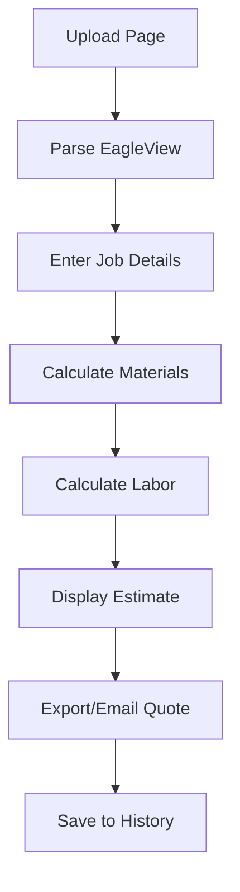

## 1. Product Overview
A web-based roofing estimation application that allows salesmen to upload EagleView reports and automatically calculate material and labor costs for roofing jobs. The app processes PDF reports through an existing parser, applies material pricing rules, and calculates labor costs based on roof complexity factors.

Target users: Roofing company salesmen using iPads in the field who need quick, accurate project estimates. Also supports desktop access for office-based staff and managers.

## 2. Core Features

### 2.1 User Roles
| Role | Registration Method | Core Permissions |
|------|---------------------|------------------|
| Salesman | Company-provided login | Upload EagleView reports, view cost estimates, download quotes |
| Admin | Pre-configured account | Manage material prices, labor rates, view all estimates |

### 2.2 Feature Module
The roofing estimator consists of the following main pages:
1. **Upload page**: EagleView PDF upload, job details input, upload progress indicator.
2. **Estimate page**: Material cost breakdown, labor cost calculation, total project estimate, export options.
3. **History page**: Previous estimates list, search and filter, estimate details view.

### 2.3 Page Details
| Page Name | Module Name | Feature description |
|-----------|-------------|---------------------|
| Upload page | File upload | Drag-and-drop or browse to select EagleView PDF files up to 50MB, validate file format before upload |
| Upload page | Job details form | Input customer name, address, project type, and notes for the estimate |
| Upload page | Processing status | Show real-time parsing progress, display success/error messages, auto-redirect to estimate page |
| Estimate page | Material calculation | Display calculated quantities for shingles, underlayment, flashing, nails based on EagleView measurements and material rules |
| Estimate page | Material pricing | Show unit prices, extended costs, and total material cost with waste factors applied |
| Estimate page | Labor calculation | Calculate base labor cost plus complexity upcharges for pitch, stories, access, and special conditions |
| Estimate page | Total estimate | Display combined material and labor costs with profit margin application |
| Estimate page | Export options | Generate PDF quote, download Excel breakdown, email estimate to customer |
| History page | Estimates list | Show all previous estimates with customer name, date, total cost, and status |
| History page | Search and filter | Filter by date range, customer name, or cost range, sort by date or amount |
| History page | Estimate details | View complete breakdown of any previous estimate with all calculations |

## 3. Core Process
**Salesman Flow:**
1. Salesman navigates to upload page on iPad
2. Uploads EagleView PDF report from device storage
3. System parses PDF using eagleview_parser.py to extract roof measurements
4. Salesman enters customer details and project information
5. System calculates material quantities using Material Order Rules
6. System applies Material Price Sheet to generate material costs
7. System calculates labor costs using Labor Pricing Sheet based on complexity factors
8. Salesman reviews complete estimate with breakdowns
9. Salesman exports PDF quote or emails directly to customer
10. Estimate is saved to history for future reference

## 4. User Interface Design

### 4.1 Design Style
- **Primary colors**: Deep blue (#1E3A8A) for headers, orange (#F97316) for accents
- **Secondary colors**: Light gray (#F3F4F6) backgrounds, white cards
- **Button style**: Rounded corners with subtle shadows, orange for primary actions
- **Font**: System fonts optimized for iPad readability (16px base size)
- **Layout style**: Card-based layout with clear sections and generous touch targets
- **Icons**: Simple line icons for upload, download, email, and navigation

### 4.2 Page Design Overview
| Page Name | Module Name | UI Elements |
|-----------|-------------|-------------|
| Upload page | File upload | Large drag-and-drop zone (400px minimum), prominent "Browse Files" button, file type and size hints |
| Upload page | Job details form | Clean form fields with large touch targets, customer autocomplete, project type dropdown |
| Upload page | Processing status | Progress bar with percentage, status messages, cancel option, estimated time remaining |
| Estimate page | Material breakdown | Expandable card sections showing quantities and costs, waste percentage clearly displayed |
| Estimate page | Labor breakdown | List of complexity factors with individual costs, total labor prominently displayed |
| Estimate page | Total summary | Large total cost display, profit margin slider, action buttons for export |
| History page | Estimates list | Card-based list with customer photos, swipe actions for quick access |

### 4.3 Responsiveness
**Multi-device responsive design supporting:**
- **Desktop**: Full-width layouts with side-by-side panels, expanded data tables, hover interactions, keyboard navigation support
- **Tablet**: iPad-optimized layouts for both landscape and portrait modes with touch-friendly interface
- **Mobile**: Single-column layouts with collapsible sections, swipe gestures, optimized for phone screens

**Responsive features:**
- Fluid grid system adapting from 320px to 1920px+ screen widths
- Breakpoints: Mobile (<768px), Tablet (768px-1024px), Desktop (>1024px)
- Touch targets: Minimum 44px on mobile/tablet, standard click targets on desktop
- Typography: Scales from 14px mobile to 16px tablet to 18px desktop
- Navigation: Hamburger menu on mobile, sidebar on tablet/desktop
- Tables: Horizontal scrolling on mobile, full-width on desktop with sortable columns
- Forms: Single column on mobile, multi-column layouts on desktop
- File upload: Drag-and-drop zone expands on larger screens, traditional file picker on mobile

## 5. Technical Requirements
- Compatible with Safari, Chrome, Firefox, and Edge across all devices
- Desktop browsers: Chrome 90+, Firefox 88+, Safari 14+, Edge 90+
- Mobile browsers: iOS Safari 14+, Chrome Mobile 90+, Samsung Internet 15+
- Tablet browsers: Full support for iPad Safari and Chrome
- Offline capability for viewing previous estimates
- Fast upload and processing (under 30 seconds for typical EagleView reports)
- Secure file handling and data storage
- PDF generation for customer quotes